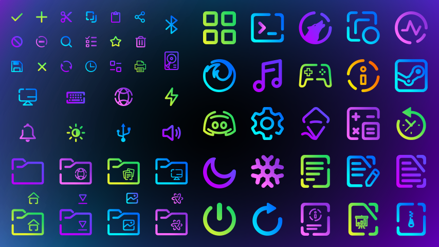

# Sours
Sours is an SVG icon theme for Linux. It is a recolor of [Beautyline](https://store.kde.org/p/1425426) and [Candy](https://github.com/EliverLara/candy-icons) icons, with [Sweet folders](https://github.com/EliverLara/Sweet-folders) and substantial original artwork added to complete the theme.

Features:

- Tasty gradients
- Rounded lines
- Uplit
- Sci-fi inspired gaps
- Color-coordinated: files match their app and directory (where possible)

## Installation
- Extract Sours.tar.gz to ~/.local/share/icons

or

- In System Settings -> Appearance -> Icons, use the 'Install from File...' dialog to find and select Sours.tar.gz

then

- In System Settings -> Appearance -> Icons, select Sours and click Apply (lower right)
- It may be necessary to log out and log back in or restart to fully apply the icon theme (icon caches are stubbornly persistent)

- For Dolphin to use the provided symbolic icons for named folders (like Downloads or Github) it may be necessary to:
    - Right-click the folder and open Properties
    - Click the icon next to its name
    - Choose the corresponding icon in the dialog

### Monochrome tray arrow
- Open /usr/share/plasma/plasmoids/org.kde.plasma.private.systemtray/contents/ui/ExpanderArrow.qml in your text editor of choice

- Add a `tray-` prefix to each instance of `arrow-[direction]`
    - For example: `return "arrow-down";` -> `return "tray-arrow-down";`
    - An example ExpanderArrow.qml is provided

- Save ExpanderArrow.qml - will require root permission

- These steps will need to be repeated after system updates and reversed after switching icon themes

Explanation: In Plasma 6, system icon themes (like Sours) now provide all icons, including those in the system tray, which traditionally have been provided by the Plasma theme. It is now much tougher to set icons to be monochrome only in the system tray - if an arrow-left-symbolic.svg is provided at a particular size, Plasma will use it everywhere that icon appears at that size, for example, both in the system tray and in toolbars (System Settings, Discover, etc). The Plasma 6 icon themes with monochrome tray icons that I have reviewed also have monochrome toolbar icons, sidestepping the issue. Sours now provides a set of tray-arrow-[direction] icons as a way to overcome this while also keeping full-color toolbar and button icons. Follow the instructions above to use the monochrome tray-arrow icons as the system tray expander arrow.

### The Display Configuration icon in System Settings is white
Most Qt apps, like System Settings or Audacious, will read configurations from their rc file, located in ~/.config (e.g. for System Settings, this file is named ~/.config/systemsettingsrc)

To change the icon theme to full color for a specific app, add the following to an app's rc file, and ensure that the file ends with an empty line:

    [Icons]
    Theme=Sours-Full-Color

## Customization
- To use the icon you want for a particular app:
    - Navigate to ~/.local/share/icons/Sours/apps/scalable
    - Duplicate the app's current icon for a backup
    - Duplicate the desired icon
    - Rename the copy to the correct name for the app and Overwrite in the dialog that appears

- When an app has the default 'W' Walyand icon, you can give it a more specific one by navigating to the 'More actions for this window' menu -> More Actions -> Configure Special Application Settings... -> Add Property -> Desktop file name -> Force -> put the preferred desktop file name. I used this method to correct the OpenRGB icon (desktop file name OpenRGB) and to give Kvantum Preview the Kvantum Manager icon (desktop file name kvantummanager). The .desktop files are located in either ~/.local/share/applications or /usr/share/applications

- Changing icon colors:
    - Use hex color codes in your preferred text editor
    - Changing icon colors in Inkscape, though convenient, is not recommended because Inkscape ignores the `fill` attribute and only modifies the `style` attribute. Both Inkscape and the Dolphin .svg preview prefer the `style` attribute, while rendered icons prefer the `fill` attribute. This creates a frustrating situation where icons will appear changed in Inkscape and Dolphin but will actually render unchanged. To solve this problem, delete `fill` attribute lines, as long as a fill is provided by the `style` attribute. After deleting `fill` attributes, editing colors in Inkscape should go smoothly.
    - [ColorHexa](https://www.colorhexa.com/) can help you identify colors and provide conversions between RGB(A) and hex color codes

- Change gradient direction in Inkscape using the gradient tool

- Modify icon shapes in Inkscape. The rounded lines can be touchy. To modify individual pieces of an icon, you can duplicate the paths you want to change, stretch/shrink the duplicates, and then use the 'Union' Path tool to make your pieces a single path again, creating a new path with the same rounded edges but a different length/width

## Notes
The conversion of Beautyline and Candy into Sours is still ongoing. Please open an issue if you notice where this process could be accelerated.

### Contributing
Icon themes are inevitably a work in progress. Please open an issue if you notice any stock or broken icons. To make an icon request, leave a comment on Pling.

### License

This project is licensed under the GNU GPL v3 - see the [LICENSE.md](LICENSE.md) file for details.

### Acknowledgements
As noted in the intro, this theme is based on [Beautyline](https://store.kde.org/p/1425426) icons by [sajjad606](https://store.kde.org/u/sajjad606) and [Candy](https://github.com/EliverLara/candy-icons) icons by [EliverLara](https://github.com/EliverLara), and incorporates EliverLara's [Sweet folders](https://github.com/EliverLara/Sweet-folders) as well.

